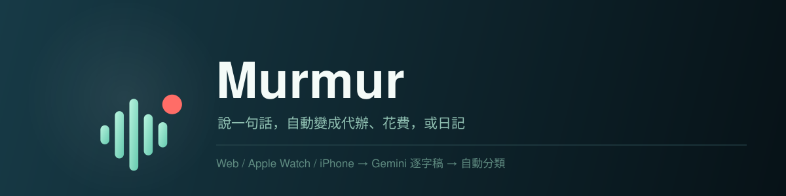
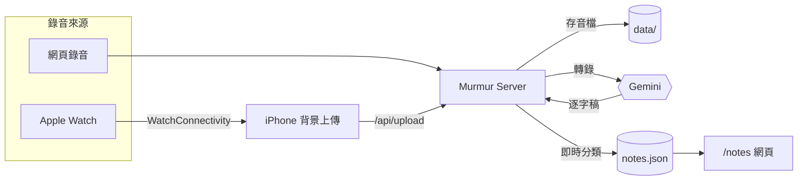

<p align="center">
  
</p>

<p align="center">
  
  
  
  
</p>

<p align="center">
  一個個人語音記事系統：從網頁或 Apple Watch 錄音，音檔上傳後由 Gemini 轉成逐字稿，再自動分類寫進當天的記事清單——不用自己打字，也不用自己整理。
</p>

## 架構



轉錄一完成就立刻分類寫進 `notes.json`，不用等排程；排程腳本只是補漏用的安全網。細節見 [server/README.md](server/README.md#記事整理notes-libjs--organizejs)。

## 這個 repo 裡有什麼

| 目錄 | 內容 |
|---|---|
| [`server/`](server) | Node.js 後端：錄音上傳、轉錄、分類、`/notes` 記事庫網頁 |
| [`apple/`](apple) | Xcode 專案：Apple Watch 錄音 App + iPhone 背景上傳 App |

兩邊各自可以獨立看：只想要網頁錄音就只跑 `server/`；Apple Watch 錄音是選配，透過 WatchConnectivity 把檔案傳給 iPhone，再由 iPhone 背景上傳到同一個 `server/` 的 `/api/upload`。

## 功能

- 🎙️ 網頁錄音、Apple Watch 錄音，兩種來源共用同一套後端
- 📝 Gemini 轉繁體中文逐字稿，轉完立刻分類，不用等排程
- 🗂️ 自動分類：代辦（可帶到期日）、花費（可帶金額）、提醒、靈感、學習筆記、日記、未分類
- ✂️ 一則逐字稿可以拆成多筆記事（例如「午餐 120，記得回信」會拆成花費＋代辦）
- ✏️ `/notes` 網頁：分類頁籤、換日期、手動新增、點文字直接行內編輯、代辦打勾、刪除、花費加總
- 🛟 排程腳本（`organize.js`）當安全網，補即時整理漏掉的部分，不會覆蓋手動編輯

## 快速開始

```bash
git clone <this-repo>
cd murmur/server
cp .env.example .env
# 編輯 .env，填入你的 Gemini API 金鑰（https://aistudio.google.com/apikey 申請）
npm install
node server.js
```

開啟 http://localhost:3000，允許麥克風權限就能開始錄音。前置需求（Node／ffmpeg）、環境變數、Docker 部署、記事整理邏輯見 **[server/README.md](server/README.md)**。

Apple Watch／iPhone App 的建置與設定見 **[apple/README.md](apple/README.md)**。

## 技術筆記

「怎麼用」寫在各自的 README；**為什麼這樣設計**另外記在 [docs/decisions.md](docs/decisions.md)，避免操作步驟跟背景脈絡混在一起。目前收錄兩件事：

- **整理時機的取捨**：從「排程整批重跑」改成「錄完立刻整理＋排程當安全網」——原本每天固定時間才整批重新分類，當天錄的東西要等到排程跑完才會出現，體感像壞了；改成轉錄一完成就用 `organizeNow()` 立刻分類單筆逐字稿，排程腳本 `organize.js` 退居成安全網，只補「當下 Gemini 剛好出錯」漏掉的部分，並用逐字稿來源檔名判斷哪些已經處理過，不會覆蓋既有記事或手動編輯。
- **自架驗證的兩個坑**：如果想在 `server.js` 前面加一層登入（例如 Cloudflare Access）取代單純的 basic auth，有兩個容易忽略但會直接弄壞功能的地方——`/api/upload` 必須排除在互動式登入之外（背景上傳沒有人能操作登入畫面），以及 Cloudflare Access 的橘雲代理跟 TLS-ALPN-01 憑證驗證會互相衝突，需要改用 HTTP-01。

## License

[MIT](LICENSE)
