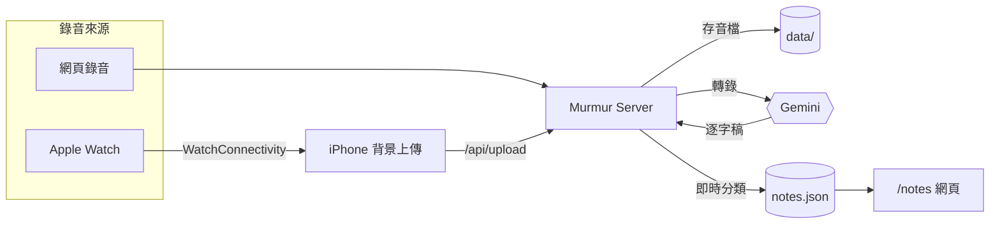

<p align="center">
  
</p>

<p align="center">
  
  
  
  
</p>

<p align="center">
  把一句話錄下來，Murmur 會把它轉成可整理、可回顧的記事。
</p>

## 架構



轉錄一完成就立刻分類寫進 `notes.json`，不用等排程；排程腳本只是補漏用的安全網。細節見 [server/README.md](server/README.md#記事整理notes-libjs--organizejs)。

## 功能

- 從網頁或 Apple Watch 錄音，兩種來源共用同一套後端
- 用 Gemini 轉成繁體中文逐字稿，再自動歸類為代辦、花費、提醒、靈感、學習筆記、日記或未分類
- 一段錄音可拆成多則記事；例如「午餐 120，記得回信」會成為一筆花費和一項代辦
- 在 `/notes` 查看每日記事、切換分類、補建或編輯內容、勾選代辦，並查看花費合計

## 專案內容

| 目錄 | 用途 |
| --- | --- |
| [`server/`](server) | 網頁錄音、上傳 API、轉錄與記事庫 |
| [`apple/`](apple) | Apple Watch 錄音與 iPhone 背景上傳 App |

只想用網頁錄音時，只需要啟動 `server/`。Apple Watch 是選配：錄音會先傳到 iPhone，再由 iPhone 上傳到同一個伺服器。

## 使用網頁版

需要 Node.js 20 以上、ffmpeg，以及一組 Gemini API 金鑰。

```bash
git clone https://github.com/bingronglee/Murmur.git
cd Murmur/server
cp .env.example .env
# 編輯 .env，填入 GEMINI_API_KEY
npm install
node server.js
```

開啟 <http://localhost:3000>，允許麥克風權限後即可開始錄音。環境變數、Docker 部署與資料儲存方式見 [server/README.md](server/README.md)。

## 使用 Apple Watch（選配）

Apple Watch / iPhone App 的建置與設定在 [apple/README.md](apple/README.md)。它需要連到已啟動、可從 iPhone 存取的 Murmur Server。

## License

[MIT](LICENSE)
